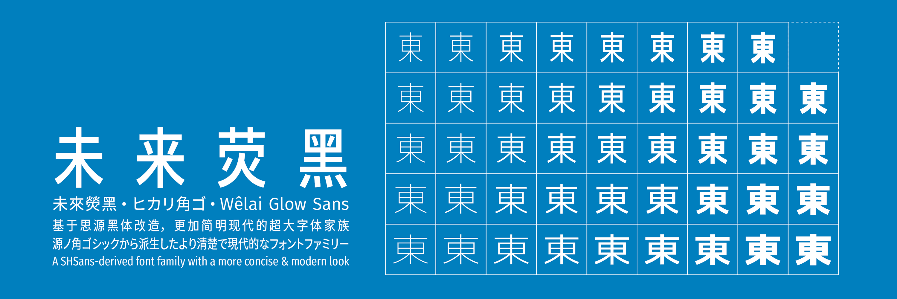
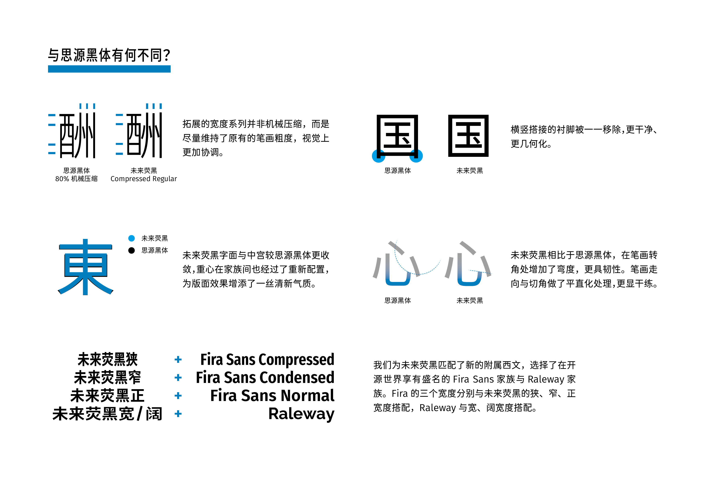

# 未來熒黑·未来荧黑·ヒカリ角ゴ·Wêlai Glow Sans



未來熒黑是一個基於[思源黑體](https://github.com/adobe-fonts/source-han-sans)、[Fira Sans](https://github.com/mozilla/Fira) 和 [Raleway](https://github.com/impallari/Raleway) 的開源字型專案，支援簡體中文、繁體中文與日文；思源黑體的 7 字重被擴展為 9 字重，並提供了寬度系列，全家族共 44 款字型。未來熒黑繁體中文版的漢字部分係改造自思源黑體韓文版，以更接近傳統印刷習慣。

相比於思源黑體，未來熒黑的造型更加簡明現代，版面效果清新輕快。未來熒黑的中宮與字面更加收斂，重心在字重之間經過了重新配置；筆畫細節上處理得更加乾淨，簡潔而平直化。您可以下載[樣張](../tests/family-specimen.pdf)來預覽未來熒黑的設計。

未來熒黑的實現介於參數化與輪廓濾鏡，使用了圖像處理算法對字形建模。字型的製作並沒有借助字型設計軟體，而是用一個 Web 實現的[可視化調參工具](https://welai.github.io/glow-sans)來確定字型參數。

## 下載

版本更新與下載鏈接會更新在 [Release 發佈頁](https://github.com/welai/glow-sans/releases)。如果您使用 `macOS` 操作系統，可以用 [Homebrew](https://brew.sh/) 包管理器來安裝未來熒黑，如繁體中文版的字體：

```shell
brew tap homebrew/cask-fonts
brew install --cask font-glow-sans-tc-compressed font-glow-sans-tc-condensed font-glow-sans-tc-extended font-glow-sans-tc-normal font-glow-sans-tc-wide
```

## 線上演示

我們為未來熒黑開發了一個[線上演示](https://welai.github.io/glow-sans)，同時它是未來熒黑修改字型參數的可視化交互環境。你可以在這裏透過改變各種參數來修改文字樣貌，導出的參數可用於字型構建。

## 與思源黑體有何不同？



## FAQ

* **Q:** 可以免費商用嗎？
* **A:** 可以。
* **Q:** 這是可變字型嗎？
* **A:** 不是。未來熒黑是透過在思源黑體上形變來改變字形形態、拓展家族的。你可以玩一玩我們的 [demo](https://welai.github.io/glow-sans)，來更加直觀地看到形變是如何實現的。
* **Q:** 支援韓文嗎？
* **A:** 不支援。以後的版本可能會提供韓文支援。
* **Q:** 曲線質量似乎不高啊？
* **A:** 因為形變算法並不完美。未來熒黑的目標僅僅是提供一個開源替代品，來彌補免費可商用中文字型的一個缺口，提供可用性上的便利。當然，提升輸出曲線質量是本專案的一個技術指標。
* **Q:** 某一個字的問題很嚴重，可以手工修復嗎？
* **A:** 沒有這個打算，但是如果現象普遍的話，會去修改算法。Pull requests are welcomed.
* **Q:** 有 TTF 版本嗎？
* **A:** 目前沒有，可能下個版本會有。
* **Q:** 爲什麽有的思源黑體支援的字在未來熒黑不支援？
* **A:** 這些字元在寬度系列的處理上存在著很大難度，因此被暫時剔除了，例如“Enclosed CJK Letters And Months”。此外，暫時不支援 `ccmp`，並不計劃支持中日韓語言的 `locl` 特性。

如果您還有其他問題或反饋，歡迎到 [Issues](https://github.com/welai/glow-sans/issues) 裏面提出。

## 構建

未來熒黑的構建完全使用程式碼來完成，請閱讀[構建說明](build-instructions.md)來了解如何構建字型與 demo。

## 許可證

© 2020 Project Wêlai

開發者：[Celestial Phineas](https://github.com/celestialphineas)

字型文件以 [SIL Open Font License 1.1](../OFL.txt) 發佈，此 repo 中構建字型開發的程式碼以 [MIT License](../LICENSE) 發佈。

## 鳴謝

感謝諸位對專案的支持與幫助！（貢獻者以 ID 字母序排列）

[@cathree3](https://github.com/cathree3), [@floating-cat](https://github.com/floating-cat), [@khsacc](https://github.com/khsacc), [@merrickluo](https://github.com/merrickluo), [@sgalal](https://github.com/sgalal), [@singularitti](https://github.com/singularitti)

## 鏈接

歡迎訪問[浙江大學科技設計創新創業實驗室](http://www.next.zju.edu.cn)。如果你對字型設計 (type design)、動態文字設計 (kinetic typography)、漢字書法與篆刻藝術有豐富知識、濃厚興趣或獨到見解，並希望從事與之相關的算法、開發與設計工作，歡迎你加入我們。對漢字歷史變遷、設計方法或藝術理論與表現手法有著深入理解，能夠去深入思考未來的文字設計，對使用深度學習的計算機視覺領域有所實踐，圖形學基礎紮實，擅長 Web 或 App 開發的同學，都可能會成為我們的夥伴。詳情諮詢請致信本專案作者 [Celestial Phineas](https://github.com/celestialphineas): celestialphineas [AT] outlook [DOT] com。
